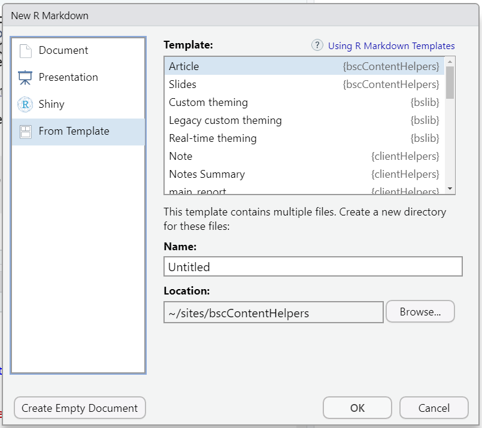

<!-- README.md is generated from README.Rmd. Please edit that file -->

```{r, include = FALSE}
knitr::opts_chunk$set(
  collapse   = TRUE,
  comment    = "#>",
  fig.path   = "man/figures/README-",
  out.width  = "100%",
  eval       = FALSE,
  fig.path   = "man/figures/"
)
```

# bscContentHelpers

<!-- badges: start -->
<!-- badges: end -->

The goal of bscContentHelpers is to provide templates and utilities for creating, editing, and storing documents for the UIC CCTS Biostatistics Core.

## Installation

You can install the development version of bscContentHelpers from [Github](https://github.com/) with:

``` r
install_github("rmlane/bscContenHelpers")
```

The repository is currently private, so you will need an authorization key. The package must be installed to access the document templates and supporting files.

## Example

This is a basic example which shows you how to solve a common problem:

```{r example, eval = FALSE}
library(bscContentHelpers)
## basic example code
```

## Document Templates

Each document template relies on three files:

### A .Rmd Template
This controls the structure of a document. For example, it may include standard headers, sample code, or boilerplate text. 

Create a new blank document based on a template by calling `rmarkdown::draft("my_article.Rmd", template = "template_name", package = "bscContentHelpers")`.

For example, to create a new tipsheet, call:

```{r}
rmarkdown::draft("covid_tipsheet.Rmd", template = "tipsheet", package = "bscContentHelpers")
```

Templates are also available through the `File > New File > R Markdown... > From Template` dialog box in R Studio.



Existing BSC templates include:

* Tipsheet. This could also be used for a short article.

### An Output Format

This controls the file type (e.g., docx, html) and the look and feel of the output document. It should be referenced in the YAML frontmatter of the Rmd document.

Current custom formats:

* `html_draft`. This should be used while developing content to avoid focusing too much on the final aesthetic details. 

TODO: 

* `tipsheet_pdf`


### A Knit Function
This controls the behavior of the knit function. It determines how the Rmd draft gets turned into the PDF output. Some settings are customizable (for example, should the final document include a table of contents?). Others are pre-configured.


## Google Drive Integration

Reading files from and writing files to Google Drive requires authorization. To ensure you have access, call:

```{r, eval = FALSE}
googledrive::drive_find(n_max = 20)
```

You should be sent to a login screen. Authorize Tidyverse API to access your Google account.

[See the Tidyverse site for `googledrive` documentation.](https://googledrive.tidyverse.org/) 

BSC files are saved in a [BSC Content folder on Google Drive](https://drive.google.com/drive/folders/16XepzMyzRAK4pcuET8goearkb0J5GwLP). View files:

```{r}
googledrive::drive_get(id = "16XepzMyzRAK4pcuET8goearkb0J5GwLP")
```

## TODO

- [ ] decide when, where, and how files should be uploaded to Drive
- [ ] set target (dynamic) locations for outputs
- [ ] write a `knit_template` function that will regenerate Rmd templates in Drive
- [ ] workflows and functions to convert from one template to another
- [ ] connect document titles to file names (and calls to `rmarkdown::draft()`)
- [ ] where to set output doc parameters for use in knit fxn?
