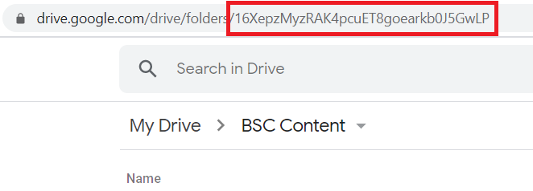

<!-- README.md is generated from README.Rmd. Please edit that file -->

# bscContentHelpers

<!-- badges: start -->
<!-- badges: end -->

The goal of bscContentHelpers is to provide templates and utilities for
creating, editing, and storing documents for the UIC CCTS Biostatistics
Core.

## Installation

You can install the development version of bscContentHelpers from
[Github](https://github.com/) with:

``` r
install_github("rmlane/bscContenHelpers")
```

The repository is currently private, so you will need an authorization
key. The package must be installed to access the document templates,
functions, and supporting files.

## Example

This is a basic example which shows you how to solve a common problem:

``` r
library(bscContentHelpers)
## basic example code
```

## Document Templates

Each document template relies on three files: [an .Rmd
template](#rmd-template), [an output format](#output-format), and [a
knit function](#knit-function).

### A .Rmd Template

At its most basic, an .Rmd template is a sample file, written in R
Markdown, that may include standard headers, sample code, or boilerplate
text. It will also contain default and placeholder settings in a header
block.

In the context of an R package, an Rmd template also includes supporting
documents and settings. This controls the structure of a document. For
example, it

Create a new blank document based on a template by calling
`rmarkdown::draft()`.

For example, to create a new tipsheet about COVID-19 data, call:

``` r
rmarkdown::draft("covid_tipsheet.Rmd", template = "article", package = "bscContentHelpers")
```

If the package is installed, templates are also available through the
`File > New File > R Markdown... > From Template` dialog box in R
Studio.


Existing BSC templates include:

-   Article. This could be used for a tipsheet or other short article.
-   Slides

Each template also includes a `references.bib` file, where references
can be included in bibtex format. Refer to sources in the format
`[@source]`.

### An Output Format

This is an R function that defines the file type (e.g., docx, html) and
the look and feel of the output document. It should be referenced in the
YAML frontmatter of the Rmd document. One Rmd file can be knit to
multiple output formats simultaneously. To allow for this, include all
outputs under `output:` in the YAML header.

Each format has default settings, some of which can be customized at the
document level.

`html_draft`. This can be used while developing content to avoid
focusing too much on the final aesthetic details. Customizations: \*
`toc: TRUE`. Include a table of contents at the start of the document?
\* `css: NULL`. Path to the CSS stylesheet to use. Defaults to a plain,
clean style.

`pptx_presentation`. This creates a PPTX.

TODO:

-   word\_document
-   pdf\_document
-   html\_webpage (or md\_webpage) – for static site
    -   [ ] consider whether this needs a separate knit function

### A Knit Function

This controls the behavior of the knit button; in other words, it
determines how the Rmd draft gets turned into the PDF (html, docx, etc.)
output.

Currently, all custom templates use the same knit function
(`bsc_knit()`). It must be explicitly mentioned in the YAML metadata of
an Rmd file (and is included in all templates).

All arguments passed to the knit function have defaults, but some can be
updated by explicitly setting parameters in the YAML header. These
include:

-   `output_file: NULL`. This sets the output document name (minus the
    file extension). This will be the same for all output formats. If
    not explicitly set, it will default to the document title, minus
    spaces and special characters.
-   `output_dir: NULL`. This sets the location where output documents
    are produced. Defaults to the same directory as the Rmd source. If
    stating explicitly, use a reference relative to the knit location.
-   `dated_file: FALSE`. Append the date to the end of the file name?
-   `file_date: Sys.Date()`. Date to be appended to the end of the file
    name, if applciable. Defaults to today’s date but can be explicitly
    overridden. To avoid errors, pass as a date object.

## Create a New Template

To start, generate a new Rmd template and supporting structures by
calling `use_rmarkdown_template()`, part of the `usethis` package. A
template should describe a type of document; for example, you might
create a template for an article or for a slide presentation.

``` r
use_rmarkdown_template("Slides")
```

Navigate to the newly created folder, located under
`inst/rmarkdown/templates/slides`. The file `template.yaml` contains the
template name and a few configurations. Edit the description, but
otherwise this file can be left alone.

To edit the .Rmd template file (which will be the basis of any documents
based on this template), open `skeleton/skeleton.Rmd`. This is where you
should put any sample text or headers that will be available each time a
new document is created.

The header block, surrounded by three ticks (`---`), includes parameters
that will be used when rendering the document to its final form. Some,
like title and date, are placeholders and may be edited every time a new
document is created. Others, like the output format and knit function,
can be standardized in this document so they will be the same every time
a document of this type is created. For more about formats and knit
functions, see below.

## Create a New Format

An Rmd template defines the content and structure of a document. Once
the content has been developed, one or more formats can be applied.
Formats define the type of file (e.g., .docx or .pptx) and the look and
feel (e.g., colors, fonts, headers) of the final product.

Note that multiple different formats can be applied to the same
template. For example, you might have an .Rmd report that can be knit as
an html draft during content development. The final version could be
knit to a pdf with custom headers, fonts, and colors.

``` r
# create a new format; this is where you'll define output type and look & feel 
use_r("pptx_presentation")
```

In the format file, create a function that defines the format. In most
cases, this function will specify options and call a base rmarkdown
format.

``` r
uic_pptx <- function() {
 
  # call the base powerpoint_presentation format
  rmarkdown::powerpoint_presentation(
    reference_doc = "my_reference.pptx"
  )
   
}
```

Supporting files should be in `inst/rmd_files/`. See examples in `R/`
(`html_draft()`) or the excellent [R Markdown
documentation](https://bookdown.org/yihui/rmarkdown/) for more examples.

## Google Drive Integration

Templates and documents are stored in a [BSC Content folder on Google
Drive](https://drive.google.com/drive/folders/16XepzMyzRAK4pcuET8goearkb0J5GwLP).
They can be accessed through R Studio via the [`googledrive`
package](https://googledrive.tidyverse.org/).

Reading and writing files requires allowing the R package to access your
Google Drive account. To ensure you have access, run:

``` r
# if necessary, install the package
install.packages("googledrive")

# view files and folders in the BSC Content Google Drive folder
googledrive::drive_ls(as_id(gd_id), recursive = FALSE)
```

You should be sent to a login screen. Authorize Tidyverse API to access
your Google account.

Files can be saved to and read from specific Google Drive locations.
Every Google Drive folder has a unique id, equivalent to the id used in
the URL in a web browser.

 To look up the id of a
subfolder (nested within BSC Content), use `find_gd_id()`

``` r
find_gd_id("Templates")
```

Any time an .Rmd template is updated in this package, generate a fresh
copy and send it to the `BSC Content/Templates` folder. This will
overwrite the existing copy on Google Drive.

``` r
upload_template_to_drive("article")
```

## TODO

-   [ ] decide when, where, and how files should be uploaded to Drive
-   [ ] set target (dynamic) locations for outputs
-   [ ] write a `knit_template` function that will regenerate Rmd
    templates in Drive
-   [ ] workflows and functions to convert from one template to another
-   [ ] connect document titles to file names (and calls to
    `rmarkdown::draft()`)
-   [x] where to set output doc parameters for use in knit fxn?
